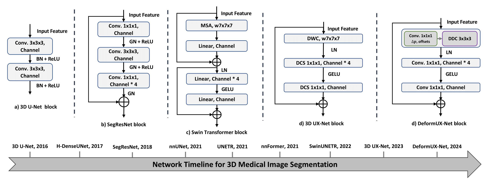
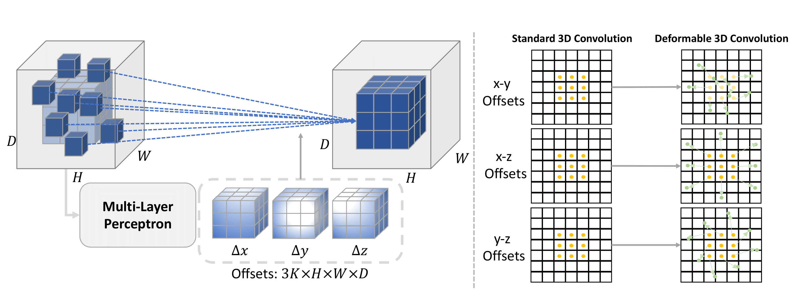

### [DeformUX-Net: Exploring a 3D Foundation Backbone for Medical Image Segmentation with Depthwise Deformable Convolution](https://arxiv.org/abs/2303.05785)

Official Pytorch implementation of 3D DeformUX-Net, from the following paper:

[DeformUX-Net: Exploring a 3D Foundation Backbone for Medical Image Segmentation with Depthwise Deformable Convolution](https://arxiv.org/abs/2303.05785). ArXiv 2023 \
Ho Hin Lee, Quan Liu, Qi Yang, Xin Yu, Shunxing Bao, [Yuankai Huo](https://hrlblab.github.io/), [Bennet A. Landman](https://my.vanderbilt.edu/masi/people/bennett-landman-ph-d/) \
Vanderbilt University \
[[`arXiv`](https://arxiv.org/abs/2303.05785)]

---

<p align="center">

</p>

<p align="center">

</p>


We propose **3D DeformUX-Net**, a pionneering volumetric convolutional network that adapt depthwise deformable convolution as the foundation backbone to address challenges from convolution to global-local self-attention mechanisms (e.g., glbal-local range dependency trade-off, adaptive spatial aggregation, computation efficiency) for medical image segmentation.

## Installation
 Please look into the [INSTALL.md](INSTALL.md) for creating conda environment and package installation procedures.

 ## Training Tutorial
 - [x] AMOS 2022 Training Code [TRAINING.md](TRAINING.md)
 <!-- - [x] AMOS 2022 Finetuning Code [TRAINING.md](TRAINING.md) -->
 
<!-- ✅ ⬜️  -->

## Results
<!-- ### FLARE 2021 Train From Scratch Models (5-folds cross-validation)
| Methods | resolution | #params | FLOPs | Mean Dice | Model
|:---:|:---:|:---:|:---:| :---:|:---:|
| nn-UNet | 96x96x96 | 31.2M | 743.3G | 0.926 | |
| TransBTS | 96x96x96 | 31.6M | 110.4G | 0.902 | | 
| UNETR | 96x96x96 | 92.8M | 82.6G | 0.886 | |
| nnFormer | 96x96x96 | 149.3M | 240.2G | 0.906 | |
| SwinUNETR | 96x96x96 | 62.2M | 328.4G | 0.929 | |
| 3D UX-Net (k=7) | 96x96x96 | 53.0M | 639.4G | 0.934 | |
| 3D UX-Net (k=21) | 96x96x96 | 65.9M | 757.6G | 0.930 | |
| 3D RepUX-Net | 96x96x96 | 65.8M | 757.4G | 0.944 | | -->


 ### Quantitative Performance on AMOS for Multi-Organ Segmentation (T.F.S: Train From Scratch)
 | Methods | resolution | #params | FLOPs | Mean Dice (T.F.S) | Model
|:---:|:---:|:---:|:---:| :---:| :---:|
| nn-UNet | 96x96x96 | 31.2M | 743.3G | 0.850 |
| TransBTS | 96x96x96 | 31.6M | 110.4G | 0.783 | 
| UNETR | 96x96x96 | 92.8M | 82.6G | 0.740 | 
| nnFormer | 96x96x96 | 149.3M | 240.2G | 0.785 | 
| SwinUNETR | 96x96x96 | 62.2M | 328.4G | 0.871 |  
| 3D UX-Net (k=7) | 96x96x96 | 53.0M | 639.4G | 0.890 | 
| UNesT (Base) | 96x96x96 | 87.2M | 258.4G | 0.891 | 
| UNesT (Large) | 96x96x96 | 279.5M | 597.8G | 0.891 | 
| 3D RepUX-Net | 96x96x96 | 65.8M | 757.4G | 0.902 | 
| 3D DeformUX-Net | 96x96x96 | 55.8M | 635.8G | 0.908 | 


 ### Quantitative Performance on KiTS, MSD Pancreas, MSD Hepatic Vessels with Five-Fold Cross-Validations 
 | Methods | KiTS Kidney | MSD Pancreas | MSD Hepatic Vessels |
|:---:|:---:|:---:|:---:|
| nn-UNet | 0.706 | 0.703 | 0.660 | 
| TransBTS | 0.669 | 0.679 | 0.613 | 
| UNETR | 0.648 | 0.667 | 0.590 | 
| nnFormer | 0.664 | 0.686 | 0.613 |
| SwinUNETR | 0.680 | 0.708 | 0.635 | 
| 3D UX-Net (k=7) | 0.697 | 0.676 | 0.652 | 
| UNesT (Base) | 0.710 | 0.690 | 0.640 | 
| 3D DeformUX-Net | 0.720 | 0.717 | 0.671 | 


<!-- ✅ ⬜️  -->
## Training
Training instructions are in [TRAINING.md](TRAINING.md). Pretrained model weights will be uploaded for public usage later on.

<!-- ✅ ⬜️  -->
## Evaluation
Efficient evaulation can be performed for the above three public datasets as follows:
```
python test_seg.py --root path_to_image_folder --output path_to_output \
--dataset flare --network DEFORMUXNET --trained_weights path_to_trained_weights \
--mode test --sw_batch_size 4 --overlap 0.7 --gpu 0 --cache_rate 0.2 \
```

## Acknowledgement
This repository is built using the [timm](https://github.com/rwightman/pytorch-image-models) library.

## License
This project is released under the MIT license. Please see the [LICENSE](LICENSE) file for more information.

## Citation
If you find this repository helpful, please consider citing:
```
@Article{lee2023scaling,
  author  = {Lee, Ho Hin and Liu, Quan and Yang, Qi and Yu, Xin and Shunxing, Bao and Huo, Yuankai and Landman, Bennett A},
  title   = {DeformUX-Net: Exploring a 3D Foundation Backbone for Medical Image Segmentation with Depthwise Deformable Convolution},
  journal = {arXiv preprint arXiv:2310.00199},
  year    = {2023}
}
```